# Introduction to QGIS and Sentinel-2 Level-2 product processing with Python

QGIS is a software aimed at reading and manipulating geographical data, such as rasters and vectorial geometries.

The goal of this introduction is a 360-degrees round trip starting from reading then writing data with QGIS, reading this data with Python tools such as pandas, rasterio, rioxarray and processing it before finally visualizing the final result back in QGIS.

More concretely, this tutorial will make you do the following:

- Download and import a Sentinel-2 product in QGIS ;
- Draw geometric shapes to samples zones corresponding to water, farmland and forest ;
- Read the results from the two previous steps with Python ;
- Generate an intermediate data structure containing reflectance values (R, G, B, NIR) from the Sentinel-2 product intersected with the priorly defined classified polygons (water, farmland, forest) ;
- Feed this data structure to a machine learning model and use it to classify the pixels of the Sentinel-2 product ;
- Import the resulting raster into QGIS and visualize it.

It is recommended to watch and practice from this video beforehand : [QGIS User 0001 from Klas Karlsson](https://www.youtube.com/watch?v=RTjAp6dZ-DU) to first become more familiar with the QGIS user interface.

This introduction also assumes a prior minimal knowledge of the Python language : defining functions, list comprehensions, etc. Nevertheless, if you don't have this knowledge yet, be reassured, the language usage in this tutorial will be simple enough so anyone having a prior programming experience can follow along.

The Python code will be broken down in independant smaller functions, for easier progress tracking and debugging.

Below is a preview of the result you will get, classifying water, farmland and forest. You can notice noise due to clouds in the top right of the image:

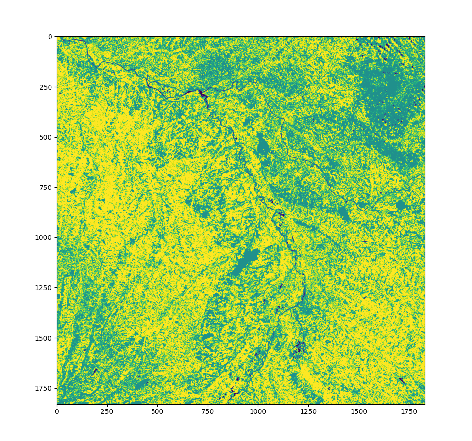

## Table of Contents

- [Introduction to QGIS and Sentinel-2 Level-2 product processing with Python](#introduction-to-qgis-and-sentinel-2-level-2-product-processing-with-python)
  - [Table of Contents](#table-of-contents)
  - [Introduction to QGIS](#introduction-to-qgis)
    - [Download a Sentinel-2 product](#download-a-sentinel-2-product)
    - [Import a Sentinel-2 product into QGIS](#import-a-sentinel-2-product-into-qgis)
      - [Files to import](#files-to-import)
      - [Operations in QGIS](#operations-in-qgis)
    - [Draw geometric shapes and classify them](#draw-geometric-shapes-and-classify-them)
      - [Export the polygons to the GeoJSON format](#export-the-polygons-to-the-geojson-format)
  - [Python](#python)
    - [Introduction](#introduction)
      - [Command line usage](#command-line-usage)
      - [Launch with VSCode (recommended)](#launch-with-vscode-recommended)
      - [~~Launch script (not recommended)~~](#launch-script-not-recommended)
      - [Write your own code](#write-your-own-code)
      - [High-level process](#high-level-process)
    - [(1) Load a GeoJSON file with `geopandas`](#1-load-a-geojson-file-with-geopandas)
      - [Expected result](#expected-result)
        - [Logs](#logs)
        - [Plot](#plot)
    - [(2) Load a Sentinel-2 raster with `rioxarray`](#2-load-a-sentinel-2-raster-with-rioxarray)
      - [Locate the interesting bands](#locate-the-interesting-bands)
      - [Use `rioxarray` to load the bands](#use-rioxarray-to-load-the-bands)
      - [Pre-processing on rasters](#pre-processing-on-rasters)
      - [Expected result](#expected-result-1)
        - [Logs](#logs-1)
        - [Plot](#plot-1)
    - [(3) Rasterize the polygons](#3-rasterize-the-polygons)
      - [Overview](#overview)
      - [Rasterize the polygons](#rasterize-the-polygons)
      - [Expected result](#expected-result-2)
        - [Logs](#logs-2)
        - [Plot](#plot-2)
    - [(4) Intersect the Sentinel-2 raster with polygons](#4-intersect-the-sentinel-2-raster-with-polygons)
      - [Expected result](#expected-result-3)
    - [(5) Persist the intersection to a CSV](#5-persist-the-intersection-to-a-csv)
      - [Expected result](#expected-result-4)
        - [Logs](#logs-3)
    - [(6) Train a machine learning model](#6-train-a-machine-learning-model)
      - [Expected result](#expected-result-5)
        - [Logs](#logs-4)
        - [Plot](#plot-3)
    - [(7) Export the classification raster result](#7-export-the-classification-raster-result)
      - [Expected result](#expected-result-6)
        - [Logs](#logs-5)
  - [Back to QGIS](#back-to-qgis)
    - [Import the classification raster result](#import-the-classification-raster-result)
  - [Feedback](#feedback)
  - [Improvements ideas](#improvements-ideas)
  - [History](#history)

## Introduction to QGIS

### Download a Sentinel-2 product

Go to https://scihub.copernicus.eu/dhus/#/home. Note that you will need to create an account in order to access the data.

Use the selection tool too select a zone of interest. Here in this tutorial, we use a zone around Toulouse.

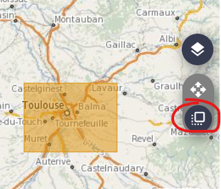  
_Selection of the zone of interest_

Fill in the search criteria :

- Here, we use a ~ 2-month time window for the _Sensing Period_: `[2022-11-01 ; 2022-12-12]`
- The _Ingestion Period_ is left empty
- Choose _Mission: Sentinel-2_
- _Satellite Platform_: `S2A_*`. The Sentinel-2 satellites work in pair. See [Sentinel-2](https://sentinel.esa.int/web/sentinel/missions/sentinel-2)
- _Product type_: `S2MSI2A`. This acronyms stands for Sentinel-2 MultiSpectral Instrument Level-2A. See [Product Types](https://sentinels.copernicus.eu/web/sentinel/user-guides/sentinel-2-msi/product-types). Rule of thumb: higher numbers in the level means more user-friendly data.
- _Cloud Cover %_: `[0 TO 9.4]`. This helps filtering out images containing too many clouds, as they add unnecessary noise.
- _Relative Orbit Number_ is left empty

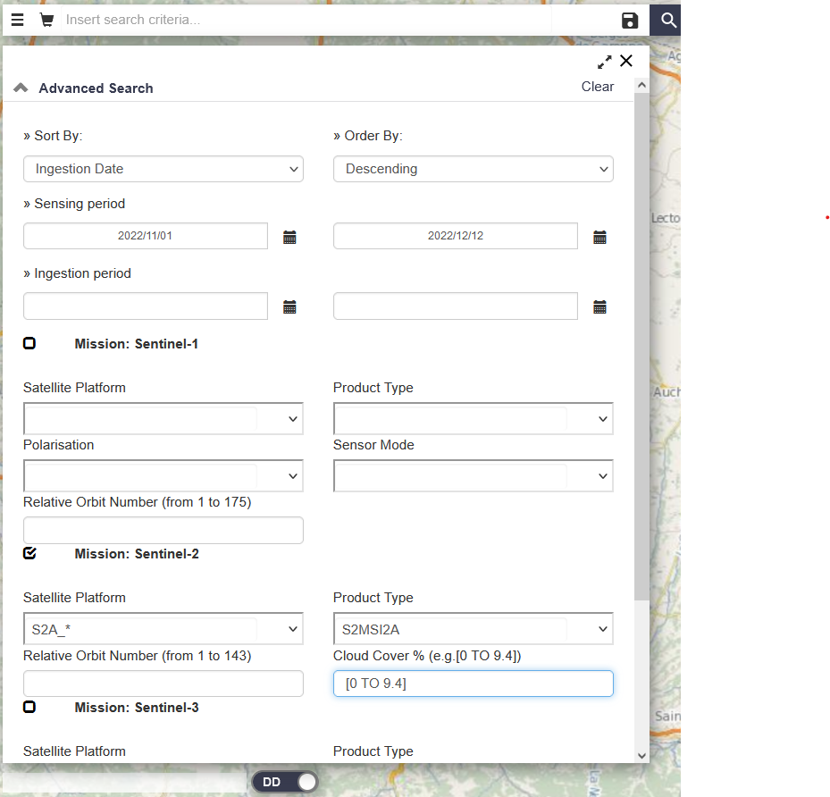  
_Search criteria_

Click on the search button represented by a magnifier, and select a product covering the zone of interest. If you cannot find any, try first to increase the time window. You can then hit the download data.

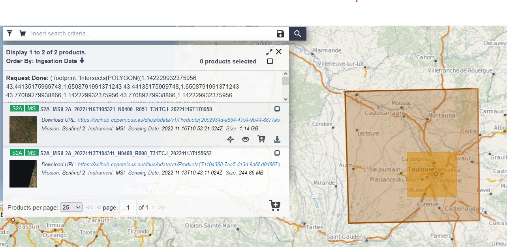  
_Search Results_

Congratulations, you've downloaded your first Sentinel-2 product! In the screenshots, the downloaded file is an archived: `S2A_MSIL2A_20221116T105321_N0400_R051_T31TCJ_20221116T170958`

We find again some information in the filename: `S2A` = Sentinel-2A, `MSIL2A`= MultiSpectral Instrument Level-2A... More information on [Naming Convention](https://sentinels.copernicus.eu/web/sentinel/user-guides/sentinel-2-msi/naming-convention)

In the next part we will visualize it into QGIS.

:information_source: If for some reason you cannot download the Sentinel-2 product, a set of the minimal files required to continue the tutorial is available under: `resources/solution/example_sentinel_files/SENTINEL.SAFE/GRANULE/L2A_T31TCJ_A038658_20221116T105603/IMG_DATA/R60m`

### Import a Sentinel-2 product into QGIS

#### Files to import

This first step is to import the interesting products from the Sentinel-2 `.SAFE` file.

The rasters of interest will be located in this folder: `GRANULE/*/IMG_DATA/R60m`. You can notice that we will use a 60m resolution, the lowest one. But you can also import others if you want to.

First, use the TCI file. It contains the Red, Blue and Green bands and can be visualized neatly into QGIS without further processing.

Then, import the bands of interest separately: Red, Green, Blue, as well as the NIR band. We will import these files in the python code coming next.

:information_source: The [Spatial Resolution](https://sentinels.copernicus.eu/web/sentinel/user-guides/sentinel-2-msi/resolutions/spatial) page gives information on which files to choose:

- RED = "B04"
- GREEN = "B03"
- BLUE = "B02"
- NIR = "B8A"

#### Operations in QGIS

Create a new project in QGIS. For each of the files of interest, import them to a new Raster layer:

Layer > Add Layer > Add Raster Layer. Select the source then click Add, closing the pop-up window.

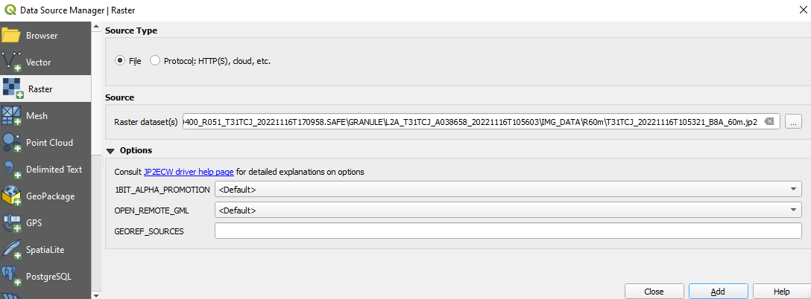

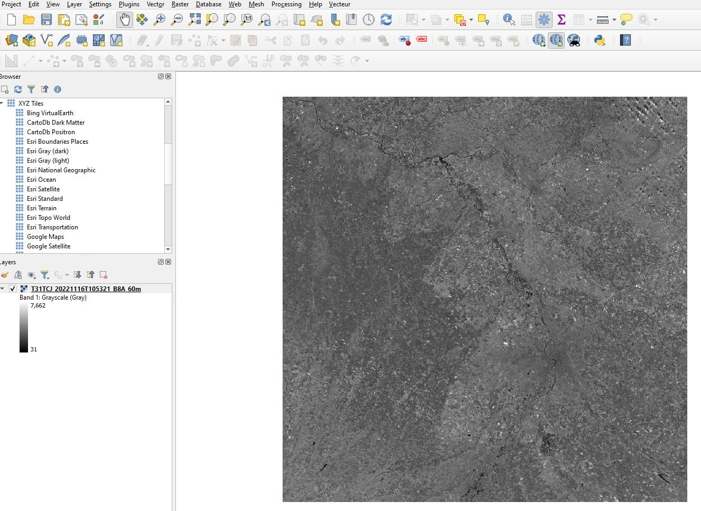

_Different Sentinel-2 files imported as Raster Layers_

You can change the default gray color palette to get a more visually interesting one. Right click on the Layer, choose Properties, then go to Symbology, then Band Rendering > Render type > Singleband pseudocolor. Then, under Color ramp, choose a more visually appealing one, eg Magma. Note that the TCI file contains all RGB bands and can be visualized instantly

### Draw geometric shapes and classify them

For each class (Water, Farmland and Forest), a unique MultiPolygon will be generated. A MultiPolygons is, without surprise, a collection of Polygons. Note that it is unordered. For more information, please refer to the [MultiPolygon section of the GeoJSON specification](https://www.rfc-editor.org/rfc/rfc7946#section-3.1.7)

Layer > Create Layer > New Shapefile Layer.

Choose the location where you want to save the file, choose Polygon as a geomtry type, and add 2 text fields:

- class: will correspond to the feature covered by the polygon: WATER, FARMLAND, FOREST
- color: will be used to assign neat colors to the classes (eg `#0000ff` for blue)

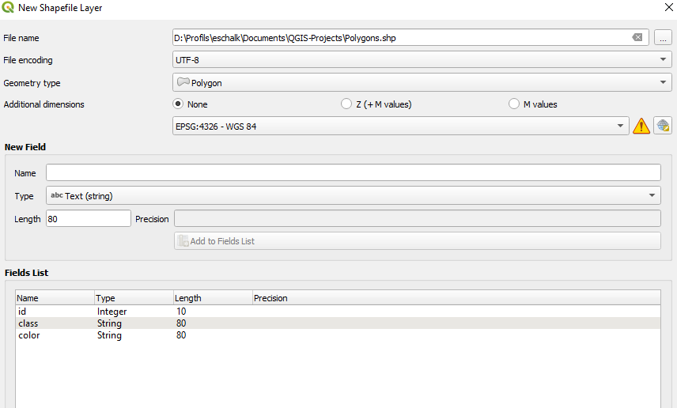

Edit the layer:

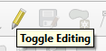

_Add a Polygon covering a water surface, with WATER as a class and a Blue color_

_Select the created polygon_

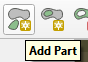

_Add Part tool will make you de facto create a to-be MultiPolygon for the JSON format_

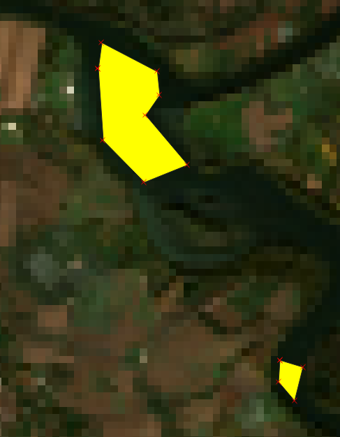

_A MultiPolygon with 2 parts, classified as WATER_

Do the same for FARMLAND and FOREST.

You can show the polygons in different colors according to their class (and color) by using:
Polygons layer properties > Symbology > Choose Categorized

Then, use `color` as a Value, and click on Classify.

Random colors are assigned, but there is a smarter way so we can use the already defined colors from the color field. For each category: Double click to open the "Edit rule" menu, then select the "Simple Fill", Fill Color > Field type: string and select `color`:

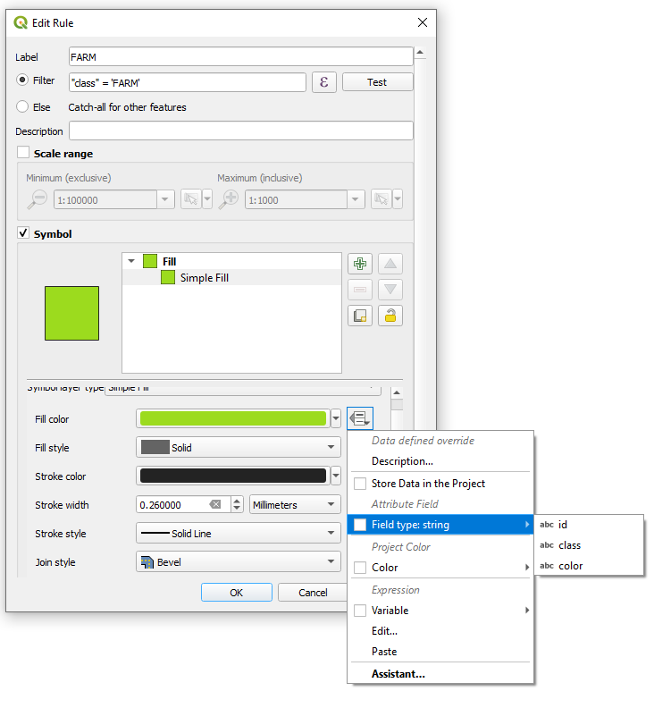

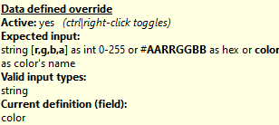

_Valid values accepted by QGIS_

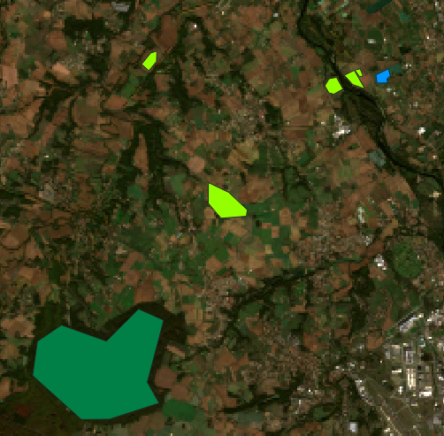

_Polygons are displayed using the hexadecimal color contained in their `color` field_

#### Export the polygons to the GeoJSON format

Right click on your polgygons layer > Export

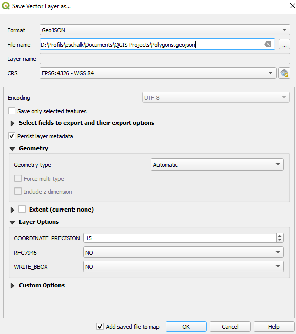

_Export under the GeoJSON format_

:information_source: You can visualize the metadata under a table format by right clicking on the polygons layer > Open Attribute Table

You can also use the button from the navigation bar:

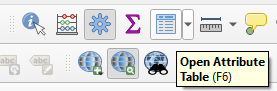

:information_source: If for some reason you cannot create the GeoJSON file, an example file is provided here: `resources/solution/polygons.geojson`

## Python

### Introduction

#### Command line usage

:information_source: All commands assume that you `cd`ed into this project root folder.

The following commands will use bash. If you are a windows user with git installed, you can create a git bash shell from VSCode.

First, to satisfy the dependencies required by the project, run:

```bash
poetry install
```

To see the different arguments the script accept, run the following command from the project's root:

```bash
python ./src/training_raster_clipper/main.py -h
```

Output:

```
usage: main.py [-h] [-p POLYGONS_INPUT_PATH] [-r RASTER_INPUT_PATH] [-o CSV_OUTPUT_PATH] [-s RASTER_OUTPUT_PATH] [-t TUTORIAL_STEP] [-v [VERBOSE]]
              [-c [CHEAT]] [-f [FIGURES]]

options:
  -h, --help            show this help message and exit
  -p POLYGONS_INPUT_PATH, --polygons_input_path POLYGONS_INPUT_PATH
                        Classified polygons
  -r RASTER_INPUT_PATH, --raster_input_path RASTER_INPUT_PATH
                        RGB raster
  -o CSV_OUTPUT_PATH, --csv_output_path CSV_OUTPUT_PATH
                        Output path for CSV classified points
  -s RASTER_OUTPUT_PATH, --raster_output_path RASTER_OUTPUT_PATH
                        Output path for the raster resulting from sklearn
  -t TUTORIAL_STEP, --tutorial_step TUTORIAL_STEP
                        Execute code until the specified step. The step must be a value among ['NONE', 'LOAD_FEATURE_POLYGONS', 'LOAD_SENTINEL_DATA',
                        'RASTERIZE_GEOJSON', 'PRODUCE_CLIPS', 'PERSIST_TO_CSV', 'CLASSIFY_SENTINEL_DATA', 'PERSIST_CLASSIFICATION_TO_RASTER', 'ALL', 'END'].
                        If not specified, run all steps.
  -v [VERBOSE], --verbose [VERBOSE]
                        Verbose
  -c [CHEAT], --cheat [CHEAT]
                        Cheating: you can switch between the solution file or your own work, as they define the same functions.
  -f [FIGURES], --figures [FIGURES]
                        Show figures at the end of the script execution. By default True
```

More details:

- TUTORIAL_STEP: Corresponds to the step in the code we want to reach. Use this during the tutorial to make the script work until the intended step.
- POLYGONS_INPUT_PATH: The GeoJSON polygons exported from QGIS
- RASTER_INPUT_PATH: The location of the `.SAFE` file containing the Sentinel-2 product
- CSV_OUTPUT_PATH: A CSV file of classified pixels of the Sentinel-2 product
- RASTER_OUTPUT_PATH: A raster resulting from the `sklearn` classification

#### Launch with VSCode (recommended)

Open `.vscode/launch.json`. This file stores "Run and Debug" configurations, useful to integrate the run of the project with the IDE tooling such as the VSCode Debugger.

Look for your username and update accordingly the command-line parameters. They are represented as a list of strings, in JSON.

Then you can debug the project (add breakpoints, use the interactive debug console to evaluate expressions, etc.).

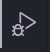  
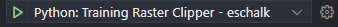  
Note that you can open the file and modify the configuration by clicking on the little cog on the right next the dropdown selector.

#### ~~Launch script (not recommended)~~

You can copy the `launch_template.sh`, replace the suffix `_template` with your username, and adapt it according to your needs so you don't have to type a long command, eg:

```bash
echo $USERNAME
./scripts/launch_${USERNAME}.sh
```

#### Write your own code

Along the tutorial, you will have to write implementations of the functions provided in `implementation/your_work.py`. Each numbered sub-section corresponds to a function.

Before starting, you can have a glimpse of what the final result will look like by using the cheat flag (`-c`). It will use the solution implementations of the functions from `implementation/solutions.py`. Remove this flag when you start coding!

#### High-level process

Below is a diagram representing the data flow, from your two inputs (the Sentinel-2 product and a GeoJSON file containing multipolygons), up to the final result: the classified Sentinel-2 product

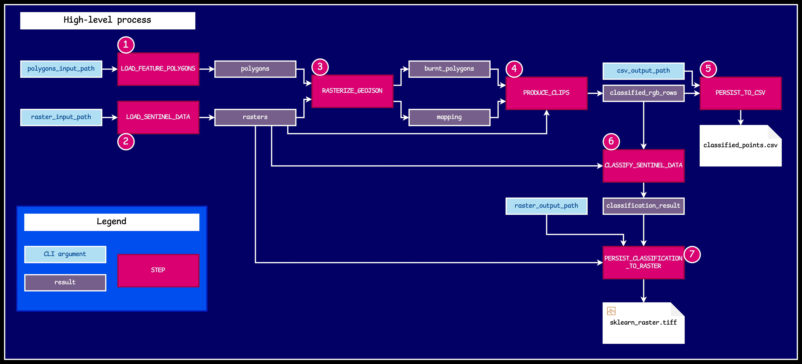

### (1) Load a GeoJSON file with `geopandas`

```python
def load_feature_polygons(input_path: Path) -> GeoDataFrame:
```

In this step, we read from a GeoJSON file and load the data to a `GeoDataFrame` from `geopandas`. See [read_file](https://geopandas.org/en/stable/docs/reference/api/geopandas.read_file.html)

The `geopandas` library adds geographical capabilities over `pandas`, such as a `geometry` column containing the description of the geographical feature. The rest of the columns are retrieved from the GeoJSON metadata.

Since the GeoJSON is in a `4326` EPSG format, we convert it to the one used by the Sentinel-2 raster: `32631`. See [to_crs](https://geopandas.org/en/stable/docs/reference/api/geopandas.GeoDataFrame.to_crs.html)

:arrow_forward: Return the GeoDataFrame representing the data contained in your GeoJSON file.

#### Expected result

##### Logs

```log
INFO:root:polygons:
   id   class    color                                           geometry
0 NaN   WATER  #0094FF  MULTIPOLYGON (((366356.635 4843608.195, 366742...
1 NaN  FOREST  #007F46  MULTIPOLYGON (((355918.751 4834466.232, 357404...
2 NaN    FARM  #94FF00  MULTIPOLYGON (((365718.363 4843753.544, 365876...
```

:eyes: We can see again our 3 MultiPolygons created from QGIS, each of them corresponding to a specific class

##### Plot

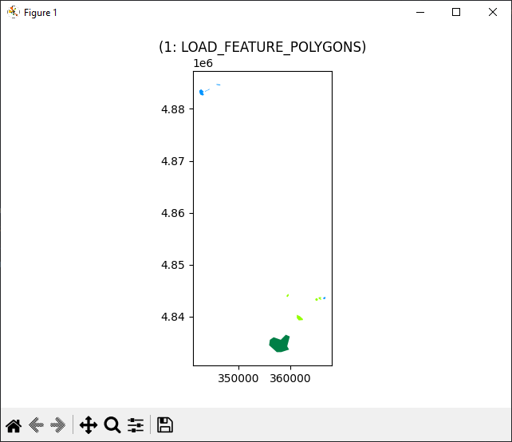

### (2) Load a Sentinel-2 raster with `rioxarray`

```python
def load_sentinel_data(
    sentinel_product_location: Path,
    resolution: ResolutionType,
    band_names: tuple[BandNameType, ...],
) -> xr.DataArray:
```

In this tutorial, we will use a resolution of 60 meters, the minimal available one, to use less memory and iterate faster.

#### Locate the interesting bands

You can see in the `main.py` file,

```python
    resolution = 60
    band_names = ("B04", "B03", "B02", "B8A")
```

The band names correspond respectively to Red, Green, Blue and Narrow NIR.

See [Spatial Resolution](https://sentinels.copernicus.eu/web/sentinel/user-guides/sentinel-2-msi/resolutions/spatial).

The glob pattern to locate the files from the `.SAFE` folder containing the Sentinel-2 product is the following: `GRANULE/*/IMG_DATA/R{resolution}m/*_{band_name}_*`

:arrow_forward: Generate a band name-indexed `Dict` of paths pointing to a raster for all band names.

#### Use `rioxarray` to load the bands

:arrow_forward: Generate a list of [`xarray.DataArray`](https://docs.xarray.dev/en/stable/generated/xarray.DataArray.html) Use [`rioxarray.open_rasterio`](https://corteva.github.io/rioxarray/stable/rioxarray.html#rioxarray-open-rasterio).

Each DataArray should be enhanced with a new "band" coord, with the value being the one from the band names. See [`xarray.DataArray.assign_coords`](https://docs.xarray.dev/en/stable/generated/xarray.DataArray.assign_coords.html)

:arrow_forward: Concatenate the rasters on a "band" dimension, using [xarray.concat](https://docs.xarray.dev/en/stable/generated/xarray.concat.html) for all band names. The final DataArray should have 3 coordinates: band, x, y.

#### Pre-processing on rasters

The Sentinel-2 reflectance values are integer-encoded, ranging from `0` to `10000`. They actually represent a reflectance value from 0 to 1, so this raw data must be pre-processed to obtain these values.

The first step after the DataArrays have been loaded is to replace the special value `0` by a NaN.

See https://docs.xarray.dev/en/stable/generated/xarray.where.html#xarray-where

Then, the reflectances should be normalized to a `[[0, 1]]` range with the following formula:

```
ρ_normalized = ρ + RADIO_ADD_OFFSET / QUANTIFICATION_VALUE
```

where ρ is the raster data containing reflectances, `RADIO_ADD_OFFSET = -1000` and `QUANTIFICATION_VALUE = 10000`

> 6. Provision of negative radiometric values (implementing an offset):A radiometric offset will be added up to the image reflectance at Level-1C. The dynamic range will be shifted by a band-dependent constant, i.e. RADIO_ADD_OFFSET. From the user’s point of view, the L1C Top of Atmosphere (TOA) reflectance (L1C_TOA) shall be retrieved from the output radiometry as follows:
>
>    Digital Number DN=0 will remain the “NO_DATA” value
>
>    For a given DN in [1;215-1], the L1C TOA reflectance value will be: L1C_TOAi = (L1C_DNi + RADIO_ADD_OFFSETi) / > QUANTIFICATION_VALUEi

_Source: [Processing Baseline](https://sentinels.copernicus.eu/en/web/sentinel/technical-guides/sentinel-2-msi/processing-baseline)_

Ensure the resulting DataArray is a `np.float32`

:arrow_forward: Normalize reflectances

#### Expected result

##### Logs

```log
INFO:root:rasters:
<xarray.DataArray (band: 4, y: 1830, x: 1830)>
array([[[0.072 , 0.0677, 0.0614, ..., 0.0329, 0.0313, 0.0291],
        [0.071 , 0.0666, 0.0674, ..., 0.0315, 0.0296, 0.0329],
        [0.0797, 0.0531, 0.0551, ..., 0.0305, 0.0296, 0.0344],
        ...,
        [0.0353, 0.0321, 0.0216, ..., 0.0713, 0.0412, 0.0603],
        [0.016 , 0.0325, 0.0314, ..., 0.1727, 0.163 , 0.108 ],
        [0.0248, 0.0357, 0.0402, ..., 0.1427, 0.133 , 0.148 ]],

       [[0.0611, 0.0578, 0.05  , ..., 0.0461, 0.0437, 0.0419],
        [0.0606, 0.0509, 0.048 , ..., 0.044 , 0.0402, 0.044 ],
        [0.0603, 0.0463, 0.0462, ..., 0.0426, 0.042 , 0.0465],
        ...,
        [0.039 , 0.043 , 0.0325, ..., 0.0606, 0.0412, 0.0514],
        [0.0243, 0.0442, 0.0474, ..., 0.1279, 0.1241, 0.0886],
        [0.0347, 0.0467, 0.0508, ..., 0.1062, 0.0989, 0.1136]],

       [[0.0347, 0.0323, 0.0276, ..., 0.0134, 0.0132, 0.0132],
        [0.0341, 0.0304, 0.0288, ..., 0.0135, 0.0129, 0.0146],
        [0.0349, 0.0231, 0.0257, ..., 0.0129, 0.0131, 0.0165],
        ...,
        [0.0115, 0.0115, 0.0037, ..., 0.0236, 0.0136, 0.0218],
        [0.0035, 0.0131, 0.0105, ..., 0.06  , 0.0596, 0.045 ],
        [0.0076, 0.0156, 0.0158, ..., 0.0488, 0.0453, 0.0577]],

       [[0.1769, 0.177 , 0.1587, ..., 0.2713, 0.2631, 0.2439],
        [0.176 , 0.1345, 0.1191, ..., 0.2511, 0.2403, 0.2547],
        [0.1519, 0.1613, 0.1484, ..., 0.2485, 0.2559, 0.2687],
        ...,
        [0.2279, 0.2605, 0.2403, ..., 0.2368, 0.2274, 0.2498],
        [0.1775, 0.3015, 0.3392, ..., 0.2312, 0.2428, 0.2548],
        [0.3155, 0.3093, 0.3304, ..., 0.1904, 0.1792, 0.1992]]],
      dtype=float32)
Coordinates:
  * band         (band) <U3 'B04' 'B03' 'B02' 'B8A'
  * x            (x) float64 3e+05 3.001e+05 3.002e+05 ... 4.097e+05 4.098e+05
  * y            (y) float64 4.9e+06 4.9e+06 4.9e+06 ... 4.79e+06 4.79e+06
    spatial_ref  int32 0
```

##### Plot

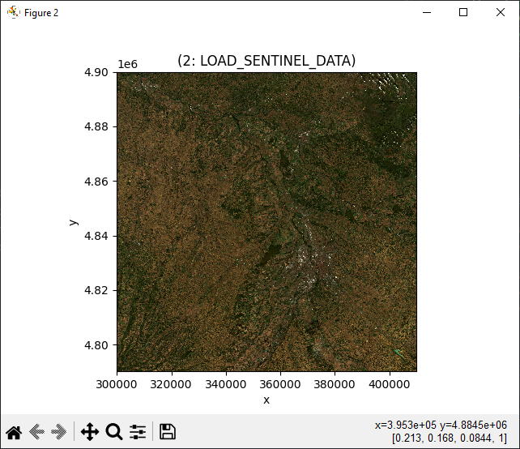

### (3) Rasterize the polygons

```python
def rasterize_geojson(
    data_array: xr.DataArray,
    training_classes: GeoDataFrame,
) -> tuple[PolygonMask, Mapping]:
```

This step uses data from the two previous steps: the metadata from the multi-band DataArray obtained with Sentinel-2 data, and the polygons loaded from the GeoJSON file into a GeoDataFrame.

Please note that the mapping should only contain strictly positive integers, as `0` cells will be treated as "empty".

The goal is to obtain a raster mask that will be later used to extract the reflectance data of pixels overlapping the classified polygons. This data can then be fed to a machine learning model to classify the rest of the pixels of the original Sentinel-2 data. The reflectances will be the "samples", and the classes the "features". Trained with a few samples, we want the model to be able to assign a "feature" to every pixel of the original Sentinel-2 image.

#### Overview

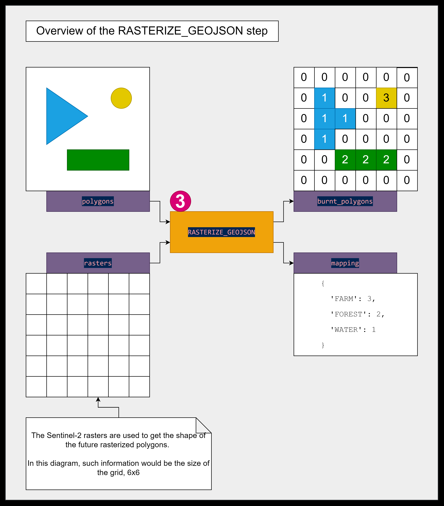

#### Rasterize the polygons

`rasterio` provides a method to realize the desired output raster of polygons: [rasterio.features.rasterize](https://rasterio.readthedocs.io/en/latest/api/rasterio.features.html#rasterio.features.rasterize). The documentation tells the required parameters. You will need:

- From the DataArray:
  - the transform available under the `spatial_ref` dimension
  - the shape, available directly under the `shape` number, without "band" (only "x" and "y")
- From the GeoDataFrame:
  - the `geometry` column,
  - the `class` column,
  - and the `index` column (can be used to generate the integer mapping)

:arrow_forward: Generate the rasterized polygons according to their class. Return a tuple with the rasterized polygons + the generated integer mapping.

#### Expected result

##### Logs

```log
INFO:root:burnt_polygons:
array([[0, 0, 0, ..., 0, 0, 0],
       [0, 0, 0, ..., 0, 0, 0],
       [0, 0, 0, ..., 0, 0, 0],
       ...,
       [0, 0, 0, ..., 0, 0, 0],
       [0, 0, 0, ..., 0, 0, 0],
       [0, 0, 0, ..., 0, 0, 0]], dtype=uint8)
INFO:root:mapping:
{'FARM': 3, 'FOREST': 2, 'WATER': 1}
```

##### Plot

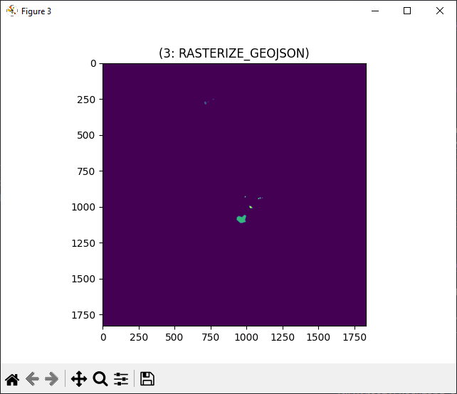

### (4) Intersect the Sentinel-2 raster with polygons

```python
def produce_clips(
    data_array: xr.DataArray, burnt_polygons: PolygonMask, mapping: Mapping
) -> ClassifiedSamples:
```

The goal of this step is to extract the reflectance values of all pixels of the Sentinel-2 data intersecting with a polygon, assign them to the corresponding polygon's class, and so for all bands. The result is basically a table, with columns containing reflectance values of all bands, and a column containing the class of the pixel coming from the overlapping polygon.

:arrow_forward: Return this table.

#### Expected result

```log
INFO:root:classified_rgb_rows:
<xarray.Dataset>
Dimensions:      (band: 4, z: 3113)
Coordinates:
  * band         (band) <U3 'B04' 'B03' 'B02' 'B8A'
Dimensions without coordinates: z
Data variables:
    reflectance  (band, z) float32 0.007 0.0071 0.0097 ... 0.2284 0.2005 0.1912
    feature_id   (z) int64 1 1 1 1 1 1 1 1 1 1 1 1 1 ... 3 3 3 3 3 3 3 3 3 3 3 3
```

### (5) Persist the intersection to a CSV

```python
def persist_to_csv(
    classified_rgb_rows: ClassifiedSamples,
    csv_output_path: Path,
) -> None:
```

:arrow_forward: With the help of a pandas DataFrame, output the previously obtained numpy array of band names and class to a CSV File. Columns must be all the band names, followed by the integer representing the class of the pixel.

#### Expected result

##### Logs

```log
INFO:root:Written CSV output generated\classified_points.csv
```

Excerpt from an example of a generated file:

```csv
B04;B03;B02;B8A;feature_id
0.007;0.0152;0.0041;0.0073;1
0.0071;0.0148;0.0036;0.0173;1
0.0097;0.0175;0.0047;0.03;1
0.014;0.0218;0.0067;0.0476;1
0.0064;0.0155;0.004;0.0073;1
0.0063;0.0148;0.0038;0.0081;1
0.0068;0.0141;0.0037;0.0062;1
0.0062;0.0138;0.0035;0.0046;1
0.0068;0.0143;0.0039;0.0052;1
0.0064;0.0136;0.004;0.0068;1
```

### (6) Train a machine learning model

:information_source: For more details about the theoretical background of this section, you can ask Pierre Louvart

```python
def classify_sentinel_data(
    rasters: xr.DataArray,
    classified_rgb_rows: ClassifiedSamples
) -> np.ndarray:
```

We will now use the tools provided by `scikit-learn` to classify the rest of the pixels of the Sentinel rasters.

:arrow_forward: Instantiate a [`RandomForestClassifier`](https://scikit-learn.org/stable/modules/generated/sklearn.ensemble.RandomForestClassifier.html)

:arrow_forward: Extract the training input samples from the `classified_rgb_rows`: they are all the columns except the last one from

:arrow_forward: Extract the class labels from the `classified_rgb_rows`: it is the last remaining column

:arrow_forward: Train the model using [`RandomForestClassifier.fit`](https://scikit-learn.org/stable/modules/generated/sklearn.ensemble.RandomForestClassifier.html#sklearn.ensemble.RandomForestClassifier.fit)

:arrow_forward: Use the model to [`predict`](https://scikit-learn.org/stable/modules/generated/sklearn.ensemble.RandomForestClassifier.html#sklearn.ensemble.RandomForestClassifier.predict) the classes of the rest of the Sentinel-2 raster, and return the result. The prediction needs a list of elements, with each element being a list of reflectances in all bands. See `reshape` from numpy. Remainder: `rasters.values` gives access to the underlying numpy array.

#### Expected result

##### Logs

```log
INFO:root:classification_result:
<xarray.DataArray (y: 1830, x: 1830)>
array([[3, 3, 2, ..., 2, 2, 2],
       [3, 3, 3, ..., 2, 2, 2],
       [3, 2, 2, ..., 2, 2, 2],
       ...,
       [2, 2, 2, ..., 3, 2, 2],
       [2, 2, 2, ..., 3, 3, 3],
       [2, 2, 3, ..., 3, 3, 3]], dtype=int64)
Coordinates:
  * x            (x) float64 3e+05 3.001e+05 3.002e+05 ... 4.097e+05 4.098e+05
  * y            (y) float64 4.9e+06 4.9e+06 4.9e+06 ... 4.79e+06 4.79e+06
    spatial_ref  int32 0
```

##### Plot

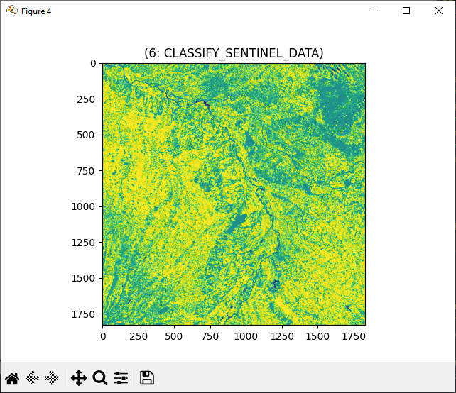

~~### Add the NIR band to get better results~~

~~The goal of this part is to show that using the NIR (Near-Infrared) band can help identify water and provide better classification results. The subsidiary goal is to show that with a flexible enough code, loading this NIR band should be as simple as adding a new value in the `Color` enum.~~

_Note: Removed because the NIR band is included from the start_

### (7) Export the classification raster result

```python
def persist_classification_to_raster(
    raster_output_path: Path, classification_result: ClassificationResult
) -> None:
```

The main difficulty here is to reconstruct a new raster from the classification result and the original sentinel raster.

:arrow_forward: Create an [`xarray.DataArray`](https://docs.xarray.dev/en/stable/generated/xarray.DataArray.html) from the classification result. Reuse the "x" and "y" `coords` from the original sentinel raster. :warning" Assign `dims` in the correct order ("y" then "x").

:arrow_forward: Set the CRS based on the `crs_wkt` attribute of the `spatial_ref` dim of the original sentinel raster. For this, use [`write_crs`](https://corteva.github.io/rioxarray/stable/rioxarray.html#rioxarray.rioxarray.XRasterBase.write_crs) from the `rio` accessor. This accessor is added on `xarray.DataArray`s by the `rioxarray` extension.

:arrow_forward: Persist the `xarray.DataArray` to a raster, using the [to_raster](https://corteva.github.io/rioxarray/stable/rioxarray.html#rioxarray.raster_array.RasterArray.to_raster) function from the `rio` accessor

#### Expected result

##### Logs

```log
INFO:root:Written Classified Raster to generated\classified_points.csv
INFO:root:Congratulations, you reached the end of the tutorial!
```

## Back to QGIS

### Import the classification raster result

As done before, add a Raster layer using the output `.tiff` file generated from the python script. In the Symbology menu, choose Paletted/Unique values, then classify. It is left to the reader to display the raster using the already defined colors from the GeoJSON file!

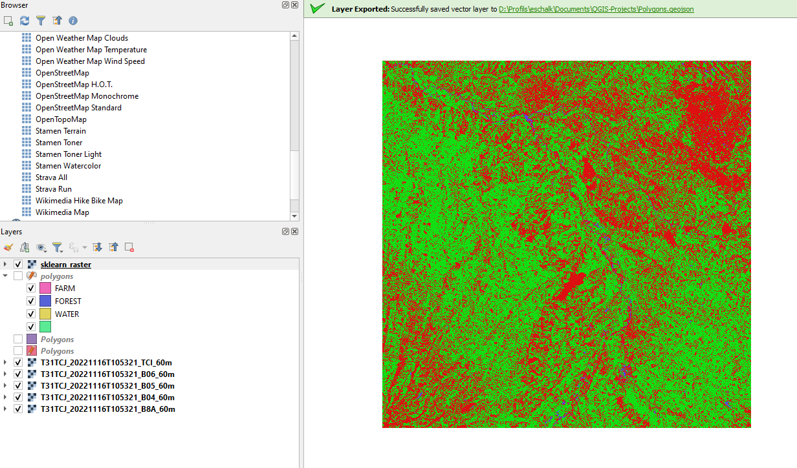

## Feedback

If you have any questions or feedback regarding this tutorial, please contact me (Etienne) or Pierre

## Improvements ideas

Application-specific

- In the step (1), the GeoJSON is converted to the raster's CRS, but this is hardcoded. A better way would be to retrieved the CRS directly from the Sentinel-2 raster. Note that this means the step (1) would now depend on (2). The CRS can be accessed via the `crs` attribute on the `rio` accessor of the raster. See [Accessing the CRS object](https://corteva.github.io/rioxarray/stable/getting_started/crs_management.html#Accessing-the-CRS-object)
- In the step (2), Use [`stackstac`](https://stackstac.readthedocs.io/en/latest/basic.html) to query the Sentinel-2 raster without having to manually download it via the Sentinel Hub Web UI. Sections of the raster also can be selected, rather than the whole.
- In the step (3), Rasterization of GeoJSON: Instead of rasterizing the polygons to the same shape of the rasters, extract only the area containing them. This would save unnessary zeroes surrounding the polygons (the rasterized polygon mask has very low information density)
- Explore the step (6): Try other classes, or unsupervized learning?
- You can add another step to persist the model, so it can be computed once and then reused on other images, rather than recalculating it on each script execution
- You can export the palette with python and auto import in QGIS
- You can show the legend for classes

Python-specific

- [ ] Use `click` instead of `argparse` for the UI
- [ ] Use notebooks to run the custom implementations, for easier testing?
- [ ] Do not hardcode tutorial step, instead catch the NotImplemented exception at runtime and exit gracefully (display plots)

## History

- [x] eschalk add title to plot
- [x] eschalk improve logging
- [x] eschalk create a helper imshow function
- [x] eschalk Create on the QGIS part a color field as well as the class field
